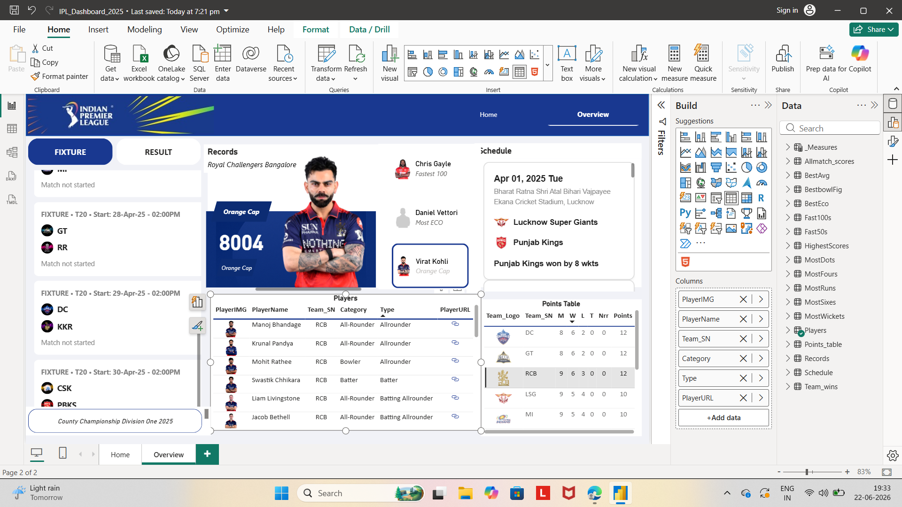
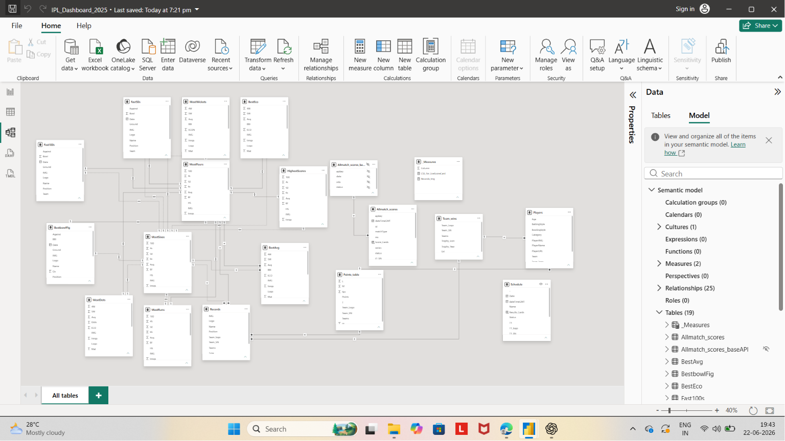
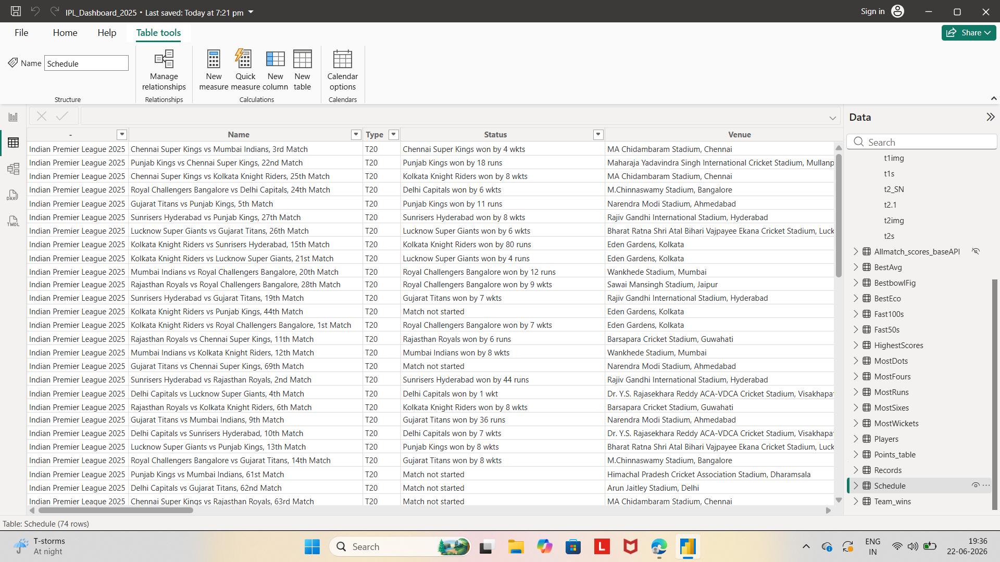

# 🏏 IPL 2025 Data Analysis Power BI Dashboard



## 📌 Project Overview

This project is an interactive **Power BI Dashboard** built to analyze and visualize **IPL 2025** data. The dashboard provides comprehensive insights into team performance, player statistics, match schedules, results, records, and tournament standings.

The objective of this project is to transform raw IPL data into meaningful insights using **Power BI, DAX, Power Query, and Data Modeling**.

---

## 🚀 Features

### 📅 Match & Fixture Analysis

* Upcoming Match Fixtures
* Match Results
* Match Status Tracking
* Venue Information

### 🏏 Batting Analysis

* Orange Cap Leader
* Most Runs
* Highest Individual Scores
* Fastest Century
* Most Fours
* Most Sixes

### 🎯 Bowling Analysis

* Most Wickets
* Best Bowling Figures
* Best Economy Rate

### 🏆 Team Performance

* Points Table
* Team Wins Analysis
* Team Rankings
* Match Outcome Insights

### 📊 Interactive Dashboard

* Dynamic Filters
* Drill-through Analysis
* Interactive Visuals
* Responsive Navigation

---

## 🛠️ Tools & Technologies Used

| Tool             | Purpose                        |
| ---------------- | ------------------------------ |
| Power BI Desktop | Dashboard Development          |
| Power Query      | Data Cleaning & Transformation |
| DAX              | Calculations & Measures        |
| Excel / CSV      | Data Source                    |
| Data Modeling    | Relationship Management        |

---

## 📸 Dashboard Screenshots

### 🏠 Dashboard Overview


---

### 🔗 Data Model & Relationships



---

### 📁 Dataset Preview



---

## 🗂️ Data Model

The dashboard follows a relational model connecting multiple tables:

* Players
* Match Scores
* Schedule
* Team Wins
* Records
* Points Table
* Batting Statistics
* Bowling Statistics

This structure enables efficient filtering, calculations, and interactive reporting.

---

## 📊 KPIs Included

✔ Orange Cap Holder

✔ Most Runs

✔ Fastest Century

✔ Highest Score

✔ Most Sixes

✔ Most Fours

✔ Most Wickets

✔ Best Economy

✔ Team Standings

✔ Match Results

---

## 📂 Repository Structure

```text
IPL-2025-Data-Analysis-Power-BI-Dashboard-
│
├── IPL_Dashboard_2025.pbix
├── README.md
├── Dashbord.png
├── Relation.png
└── Data-set.png
```

---

## ⚙️ Installation & Usage

### Clone Repository

```bash
git clone https://github.com/Prajval4241/IPL-2025-Data-Analysis-Power-BI-Dashboard-.git
```

### Open Project

1. Download the repository.
2. Open `IPL_Dashboard_2025.pbix` using Power BI Desktop.
3. Refresh data if required.
4. Explore interactive reports and visualizations.

---

## 📈 Business Insights

* Identify top-performing teams.
* Track Orange Cap race.
* Analyze batting and bowling leaders.
* Compare team performance.
* Monitor tournament standings.
* Explore venue-based match trends.


### Power BI | Data Analytics | Data Visualization | IPL 2025 Analytics
